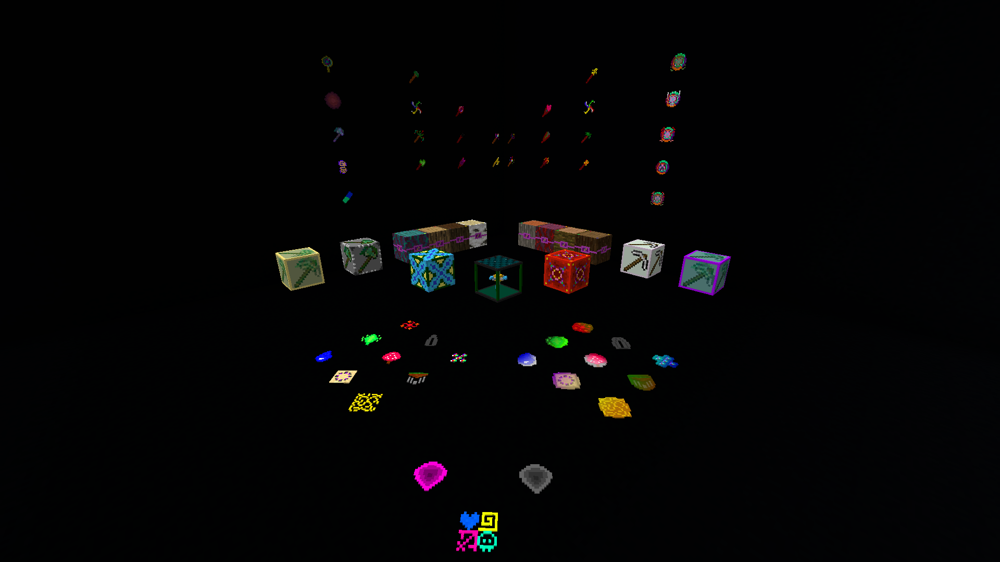

# Magical Elementalization

   

</img>

</img>

## 🤔 What is this?

***Magical Elementalization*** is a magic datapack for <u>Minecraft</u> which use a resources pack to have the best experience.

This datapack add content based on magic essences (based on biomes).

### 📜 Features:

- Magical Essences
- Spells (Wands/Staff/other things with no keywords of object type distinction in the name/Compact ... Spell)
- Bosses
- Magical Items : Boss Loots, Craft components
- Generators for Magical Essences (Pylons)
- Capacitors
- Rituals
- <a href="./Resourcespack/assets/lthc.mage/sounds">🎶 Custom Sounds</a>
- <a href="./Resourcespack/assets/minecraft/lang">📒 Translations</a>
- Mental State/Health System
- Upgrade System
- <a href="#admin">⚙️ Admin Functions</a>

### 👍 Compatibilities:

- Compatible with <a href="https://www.planetminecraft.com/data-pack/terralith-overworld-evolved-100-biomes-caves-and-more/">Terralith</a> by <a href="https://www.planetminecraft.com/member/starmute/">Starmute</a>
- Compatible with <a href="https://www.planetminecraft.com/data-pack/william-wythers-overhauled-overworld/">William Wythers' Overhauled Overworld</a> by <a href="https://www.planetminecraft.com/member/williamwythers/">WilliamWythers</a>
- Compatible with <a href="https://www.planetminecraft.com/data-pack/incendium-nether-expansion/">Incendium</a> by <a href="https://www.planetminecraft.com/member/starmute/">Starmute</a>
- Compatible with <a href="https://www.planetminecraft.com/data-pack/nullscape/">Nullscape</a> by <a href="https://www.planetminecraft.com/member/starmute/">Starmute</a>
- Compatible with <a href="https://www.planetminecraft.com/data-pack/stardust-fragment/">Stardust Fragment</a> by <a href="https://www.planetminecraft.com/member/stoupy51/">Stoupy51</a>

### 💽 Versions
| ✅   | 1.19.x |
| --- | --------------- |
| ✅   | Singleplayer    |
| ✅   | Multiplayer     |
| ✅   | Vanilla         |
| ✅   | Optifine        |
| ✅   | Iris-Sodium     |
| ✅   | Fabric          |
| ⚠   | Forge           |
| ❓   | Realms          |
| ❌   | Bukkit          |
| ⚠   | Spigot          |
| ⚠   | Paper           |

## ▶️ How i start?

To start, you just have to wait for a magical trader and have some logs, sticks, buckets and glass blocks to trade a mage wand and a collector pylon.

The mage wand can help you for the placement of the collector pylon. The collector pylon can get essence depending on the biomes where it is placed.

## 📚 Inspiration

This datapack is inspired of the Thaumcraft mod (by Azanor (<a href="https://www.google.com/url?sa=t&rct=j&q=&esrc=s&source=web&cd=&cad=rja&uact=8&ved=2ahUKEwimg87jlZX1AhVKAWMBHUozDXYQFnoECAMQAQ&url=https%3A%2F%2Fwww.curseforge.com%2Fminecraft%2Fmc-mods%2Fthaumcraft&usg=AOvVaw2-QWITRw7wyGFE65JAPCmV">link</a>)) and the Florcraft datapack (by Hashs (<a href="https://www.planetminecraft.com/data-pack/florcraft-magical-essence-wizardry/">link</a>))

## 🫂 Credits

Thanks to DataWorld discord (<a href="https://discord.me/dataworld">link</a>). Also thanks to Azanor and Hashs for their works which inspired me

Also thanks to <a href="https://github.com/Stoupy51">Stoupy51</a> for helping me in optimization

## 🤝 Contributors

## Direct Resources Pack Link

<a href="https://github.com/LTHCTheMaster/Magical-Elementalization/raw/Dev/magical_elementalization_rp.zip">https://github.com/LTHCTheMaster/Magical-Elementalization/raw/Dev/magical_elementalization_rp.zip</a>

## ⚙️ Admin Functions

- Force a full reloading of functions: ``/function lthc.mage:admin/force_full_reload``
- Have some stats on the current state of the datapack: ``/function lthc.mage:admin/stats``
- Uninstall the datapack: ``/function lthc.mage:admin/uninstall``
- Open the "Admin Menu": ``/function lthc.mage:admin/menu``

## Releases History

### 1.0 Beta **Mage Of LTHC** (old name)

### 1.0 Beta 2 **Magical Elementalization**

Renaming from Mage of LTHC to Magical Elementalization

Add a lot of things, add sounds, optimize a lot of things

### 1.0 Magical Elementalization

Magical Elementalization 1.0:
- 1.0 Beta Ended
- 8 New Spells
- 1 New Boss
- Some Fix
- Some Optimization
- Full Wiki: https://magical-elementalization.fandom.com/wiki/Magical_Elementalization_Wiki

### 1.0.1 Magical Elementalization - Magical Trader Fix

- Magical Trader Fix

### 1.1 Magical Elementalization ("Major Optimization Version")

News:
- Logical Magic and Paradoxal Magic essences and wands
- Crafting codex
- First Ritual: Mining Ritual

Changes:
- A lot of Optimization ( Big thanks to @Stoupy51 )
- Some changes on the spawning of the Elementalized Boss
- Fixes (a lot)

Removes:
- Crafting Recipes Advancements for listing the recipes

### 1.2 Magical Elementalization - Rituals and Mental State/Health Update

News:
- Three new Rituals
- Mental State/Health Update, "don't forget your pills"
- Pills Added, you can use these pills to upgrade your Mental Health to the Very Good point
- A Secret

Changes:
- Some Optimization
- Some Fix

Removes:
- No Removes :)

### 1.3 Magical Elementalization - Upgrades and Resources Optimization Update

News:
- Upgrade system

Changes:
- Resources Pack optimization

Removes:
- No Removes :)

### 1.4 Magical Elementalization - Tweaking and quality update

News:

- One new essences and a corresponding spell
- An acces to the dimension by an unbreakable portal that you can find by mining
- A compactor which is a breakable block that you can find by mining

Changes:

- Some animated textures instead of fixed textures
- A lot of tweaks

Removes:

- No Removes :)

Tweaks:

- A little bit more common pills
- A little more efficient pills
- Some tweaks on the Magical Trader
- Bosses' loots

### 1.4.1 Magical Elementalization - Fixes

News:

- Nothing

Changes:

- Fixes (a division by zero)

Removes:

- No Removes :)

### 1.5 Magical Elementalization - (release for mc 1.19) - Mental Health System Rework

News:

- Mangrove Collector Pylon
- Few things for the new Mental State/Health System

Changes:

- The Mental State/Health System (<a href="./details/mental1.5.md">more details here</a>)

Removes:

- No Removes :)

### 1.5.1 Magical Elementalization - Fixes And Improvements

News:

- Full mangrove support

Changes:

- More worldgen datapacks compatibility
- Collector Pylons can sometimes fail to generate essences
- You can place a container above a collector pylon to auto collect essences

Removes:

- No Removes :)

Fixes:

- Wrong lore on spells

### 1.6 Magical Elementalization - Magical Trader Rework

News:

- No News :( but good changes

Changes:

- Killable Magical Trader
- More Special Magical Trader

Removes:

- No Removes :)

### 1.6.1 Magical Elementalization - Fixes

News:

- No News :( but good changes

Changes:

- Fixes

Removes:

- No Removes :)

### 1.7 Magical Elementalization - Always more tiny things

News:

- Always more tiny things

Changes:

- No Changes :|

Removes:

- No Removes :)
